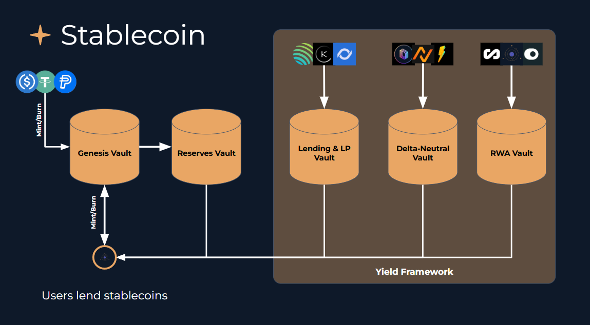

# 💵 Stablecoin (1AUD)

<figure><figcaption></figcaption></figure>

## How does 1AUD work?

Each 1AUD token is fully backed by a mix of assets that generate yield. These assets come from four main areas:

1. Stablecoins like USDC and USDT.
2. Secured lending and borrowing using stablecoins on-chain.
3. Market-neutral trading strategies on centralized and decentralized exchanges (e.g., BTC, ETH, SOL).
4. Real-world assets (RWA) that earn yield.

All 1AUD holders share equally in the performance of this combined portfolio. Returns are automatically added to the token’s value — there’s no need to stake or claim rewards.

### Strategy Vaults

Yield for 1AUD comes from actively managed **strategy vaults**, each focused on a different type of asset or income source:

* **Reserves Vault:** Holds idle funds such as USDC and USDT as liquidity reserves.
* **Lending Vault:** Earns yield from lending activities on on-chain borrow/lend protocols.
* **Hedged Vault:** Generates income from delta-neutral positions that capture funding rates across exchanges.
* **RWA Vault:** Provides yield from real-world asset (RWA) projects, including Watchtower’s borrow-side markets.

These vaults are modular and automatically rebalanced to maintain an optimal risk–reward balance.

### **How Yield Is Generated**

An accounting model continuously tracks the **Net Asset Value (NAV)** of the 1AUD portfolio. This system ensures that:

* Each 1AUD token always represents its fair share of the portfolio’s yield.
* Users don’t need to manage or interact with individual strategies.

By simply holding 1AUD in their wallet, users automatically benefit from yield generation and rebalancing. The yield each holder earns depends on their share of the total supply and the yield distributed during their holding period.

$$
Owner’s Yield =  \dfrac{Owner’s \hspace{2mm} 1AUD  \hspace{2mm} Balance}{Total \hspace{2mm} 1AUD  \hspace{2mm} Supply}  \hspace{2mm} \times  \hspace{2mm}Yield \hspace{1mm} Distributed \hspace{1mm} During \hspace{1mm} Holding  \hspace{1mm}Period
$$

### **Minting and Redemption**

* **Minting:** Users can create (mint) 1AUD by depositing accepted tokens such as USDC.
* **Redemption:** Users can exchange (redeem) 1AUD back for USDC.
* **Market Alignment:** The protocol uses arbitrage mechanisms, managed by the team and Watchdog keepers, to keep 1AUD trading close to its NAV.
  * If 1AUD trades at a premium, mint-and-sell actions occur.
  * If it trades at a discount, buy-and-burn actions are triggered.

